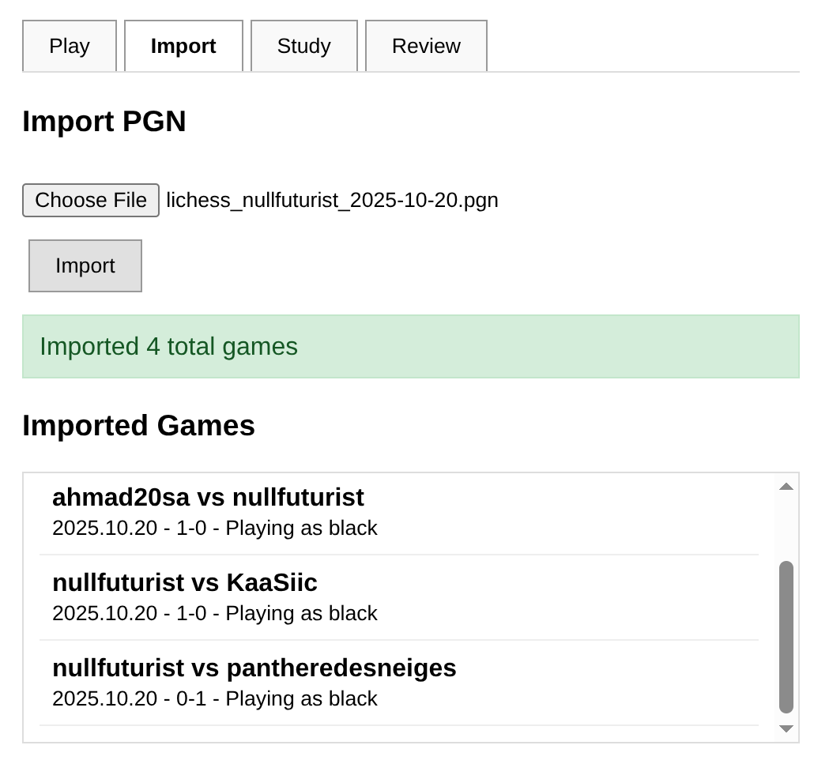
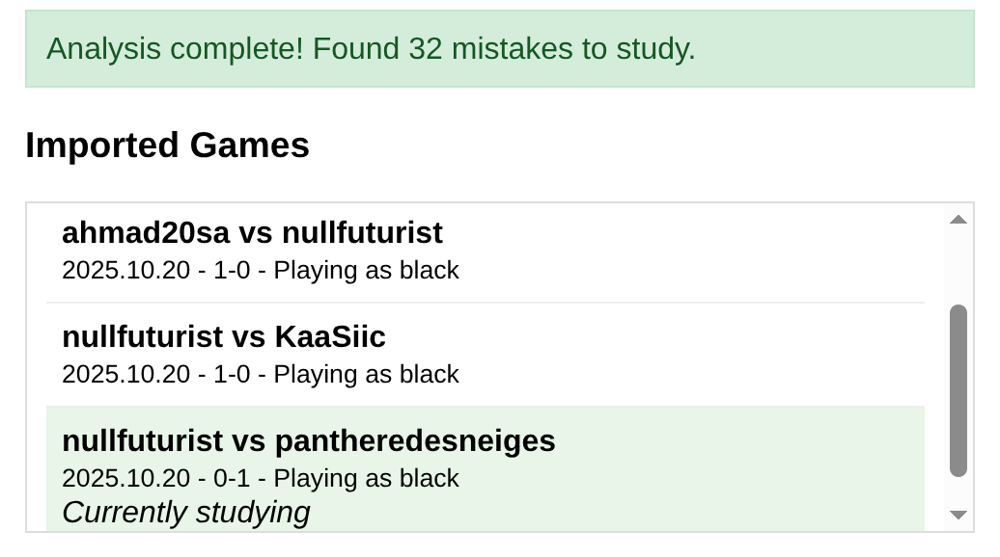

# Chess Trainer
NodeJS web server that imports user games from .pgn file (exportable from chess.com and lichess.org), automatically analyzes the
games with stockfish and extracts exercises where a poor move was made, then tests user in these repeatedly over a spaced repetition
schedule that responds to user's ability to find the right move.

There are bugs in both the analysis and review system currently. These are simple bugs in how results are passed between stockfish 
and the rest of the program, or in how the data is handled internally, the overall concept is working. To be fixed soon.
